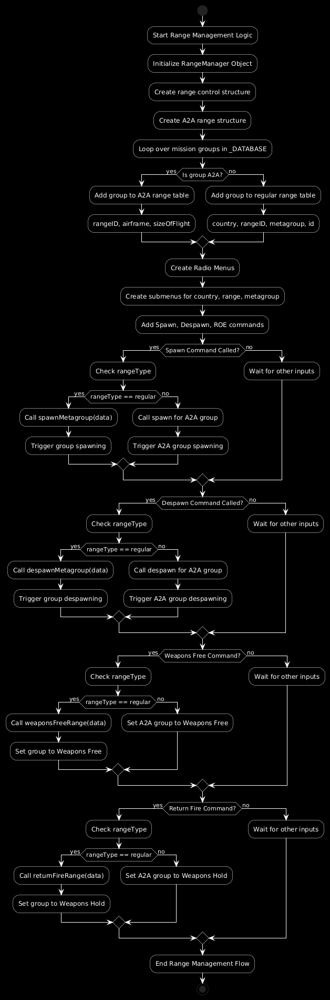

# VJaBoG32 Range Management Module

This module provides tools for managing **range units**, **LATN areas**, and **Rules of Engagement (ROE)** in DCS missions. It is designed for dynamic control of AI units on training ranges, enabling mission builders to spawn, despawn, activate, deactivate units, and manage their ROE through F10 radio menus based on naming conventions.

## General Idea

The **VJaBoG32 Range Management Module** allows you to control range areas dynamically using an F10 menu. You can spawn and despawn groups of units (called "metagroups") based on a predefined naming convention. The system supports two types of ranges:
- **Regular Ranges**: These represent conventional ground-based training units like SAM sites or ground vehicles.
- **A2A (Air-to-Air) Ranges**: Special air-to-air combat ranges with different configurations for airframes and flight sizes.

The script automatically parses the unit names in the mission, creates a hierarchical radio menu for range control, and lets you perform operations like spawning and setting ROE for each group via the menu.

## Flow of the Module

1. **Group Identification**: The script parses all groups in the mission and identifies them based on the naming convention.
2. **Radio Menu Construction**: A dynamic radio menu is created based on the identified groups, organizing them by country, range ID, and metagroups.
3. **Unified Control Interface**: Using a unified interface, mission builders can spawn, despawn, and modify the ROE of both regular and A2A ranges using the same functions, even though A2A and regular ranges are treated differently.
4. **Anonymous Functions**: Anonymous functions are used to pass arguments to the range functions when adding commands to the radio menu.

## Naming Conventions

The groups in the mission must follow a specific naming pattern for the script to identify and categorize them correctly.

### Regular Range Naming Convention

For regular ranges, the naming pattern follows this structure:
```
Country-RangeID-Metagroup-ID
```

- **Country**: A three-letter country code (e.g., `USA`, `SWE`).
- **RangeID**: A unique identifier for the range (e.g., `ESR01`, `R92A`).
- **Metagroup**: The name of the group (e.g., `Artillery Group`, `SA10`).
- **ID**: A two-digit number to ensure unique names for groups (e.g., `01`, `02`).

Example:
```
SWE-ESR01-SA10-01
```

This example represents an SA-10 site (`SA10`) on range `ESR01` in Sweden (`SWE`).

The corresponding regular expression to extract these parts is:
```lua
"^(%u%u%u)%-(%w+)%-(.-)%-(%d%d?)$"
```

### A2A Range Naming Convention

For A2A ranges, the naming pattern is slightly different:
```
A2A-RangeID-Airframe-FlightSizeAndOrdnance
```

- **A2A**: A fixed prefix to identify the range as an Air-to-Air range.
- **RangeID**: The range identifier (e.g., `ESR02`).
- **Airframe**: The type of aircraft (e.g., `F14`, `F16`).
- **FlightSizeAndOrdnance**: The number of aircraft and type of loadout (e.g., `Fox2X2`, `GunsX1`).

Example:
```
A2A-ESR02-F14-Fox2X2
```

This example represents an Air-to-Air range (`ESR02`) for 2 x F-14 aircraft using Fox-2 missiles, with a flight size of two (`Fox2X2`).

The corresponding regular expression for A2A ranges is:
```lua
"^(A2A)%-(%w+)%-(%w+)%-(.+)$"
```

## Unified Interface for Spawning and ROE Control

We designed the `spawn` function and other control methods (e.g., `despawn`, `weaponsFree`, `returnFire`) to work for both regular and A2A ranges. The advantage of this unified interface is that it simplifies the radio menu construction and allows mission builders to manage both types of ranges with the same functions.

For example:
```lua
rm:spawn({rangeType = "regular", country = "USA", rangeID = "ESR01", metagroup = "SA10"})
rm:spawn({rangeType = "a2a", rangeID = "ESR02", airframe = "F14", sizeOfFlight = "Fox2X2"})
```

Anonymous functions are used to pass these arguments into the `missionCommands.addCommand()` method when constructing the radio menu. This allows us to dynamically pass parameters when the user selects a menu option.

### Why Anonymous Functions?

When adding a command to the radio menu, we need to pass a function reference, but we also need to pass additional parameters (like `rangeType`, `country`, and `metagroup`). Using anonymous functions, we can capture these parameters and pass them to the actual range functions. For example:

```lua
missionCommands.addCommand("Spawn " .. metagroup, metagroupMenu, function() 
    rm:spawn({rangeType = "regular", country = country, rangeID = rangeID, metagroup = metagroup})
end)
```

## Radio Menu Construction

The radio menu is dynamically constructed based on the parsed groups in the mission file. The script categorizes groups by country, range ID, and metagroups. Here is how the menu is structured:

```
Range Control
- SWE
    - ESR01
        - Artillery Group
        - SA10
    - R92A
        - Two F16s
A2A Ranges
- ESR02
    - F14
        - GunsX1
        - Fox2X2
    - F16
        - Fox2X1
```

For each metagroup (or flight size for A2A ranges), the following commands are added:
- **Spawn**: Spawns the group.
- **Despawn**: Despawns the group.
- **Weapons Free**: Sets the ROE to open fire.
- **Weapons Hold**: Sets the ROE to hold fire.

## Detailed Design for Developers

The code is structured into the following main components:

1. **Group Parsing**: This is the first step where we loop through all groups in the mission using the `_DATABASE.GROUPS` structure. We apply regular expressions to match the naming conventions for both regular and A2A ranges.

2. **Data Storage**: For regular ranges, groups are stored in a hierarchical structure under `rm.ranges`, while A2A ranges are stored under `aaRanges`.

3. **Unified Control Functions**: The `RangeManager` class has generic functions like `spawn`, `despawn`, `weaponsFree`, and `returnFire` that handle both regular and A2A ranges based on the `rangeType` passed as an argument.

4. **Radio Menu Construction**: The dynamic menu is constructed after parsing the groups, with separate menus for regular ranges and A2A ranges.

5. **Anonymous Functions**: Used within `missionCommands.addCommand` to pass arguments dynamically to the range functions.




## How to Use for Mission Builders

Prerequisite
- MIST
- a top level radio menu called `generalOptons`

1. **Name Your Groups**: Ensure that the groups in your mission follow the naming conventions mentioned above. This allows the script to parse and categorize them correctly.
   
   - For regular ranges, name groups like: `USA-ESR01-Artillery-01`
   - For A2A ranges, name groups like: `A2A-ESR02-F16-Fox2X2`

2. **Load the Script**: In your mission file, load the `rangeManagement.lua` script using a `dofile` command in the mission's initialization script:

Example
   ```lua
   dofile("C:/path/to/rangeManagement.lua")
   ```

3. **Radio Menu**: Once the mission starts, the script will automatically construct the F10 radio menu with options to spawn, despawn, and control ROE for the groups based on the naming convention.

4. **Testing**: Use the F10 radio menu to test spawning and controlling your groups. The script provides feedback via `trigger.action.outText()` to inform you of the status of each group.
